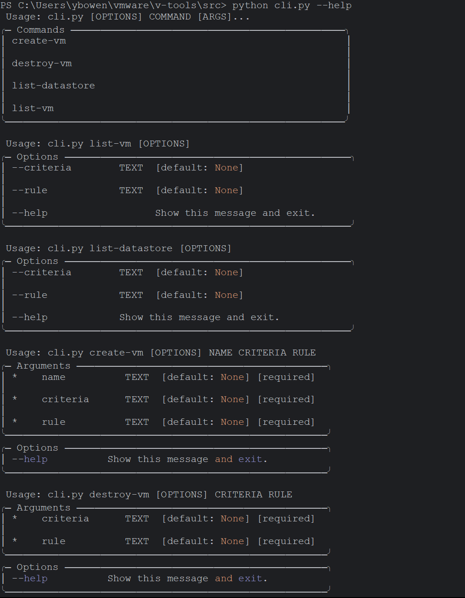

# vtools

This is an API for the VMware ESXi, a hypervisior that allows user to control VMs.
The vtools encapsulates several classes:
- ESXi class: a class that represents an ESXi account, with functionalities including creating, destroying, and listing
VMs and datastore on the ESXi account.
- VM class: a class that represents an VM, along with all of its properties.
- Datastore class: a class that represents a datastore, along with all of its properties.

# Usage

